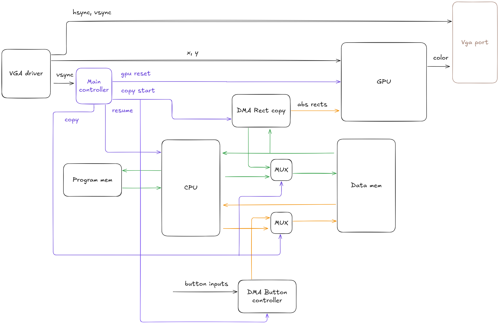

# Brus-16 fpga implementation

The repository contains the implementation of the [Brus-16 educational game console](https://github.com/true-grue/Brus-16).


Gameplay videos:

https://github.com/user-attachments/assets/1e40cc49-c51c-4474-aa89-dd89034edd95

https://github.com/user-attachments/assets/afb5e501-f497-4eca-b2d6-a9d5f201da5c

### Contents

- [Architecture](#architecture).
- [Board-specific](#board-specific).
- [Build firmware for new game](#build-firmware-for-a-new-game).
- [PMOD joystick kit connection](#pmod-joystick-kit-connection).
- [Simulation](#simulation).
- [Tests](#tests).


### Architecture

More general information can be found [here](https://github.com/true-grue/Brus-16?tab=readme-ov-file#architecture).

High-level diagram of a game console:



#### Key notes

CPU:
- The **Single-cycle** processor calculates the next frame and enters the wait state.
- After the resume signal, it **continues** its work from the previous location.
- [ISA is available here](https://true-grue.github.io/Brus-16/isa.html).

GPU:

- **No framebuffer**.
- Uses a frame representation in the form of a 640x480x64 matrix, where each of the 64 bits indicates the intersection of a rectangle with a specific pixel, rect_left <= x < rect_right && rect_top <= y < rect_bottom for each rect for each pixel.
- Due to the properties of rectangles, the 640x480 matrix is represented as two arrays of 640 and 480 and is calculated during copying.
- During operation, the GPU obtains a 64-bit vector of rectangle collisions with the current pixel and passes the rectangle indices through a tree of multiplexers.
- The color is sent to the output based on the index from a mux tree.

Multiplexer tree diagram for 4 inputs:


Other:

- The main controller wakes up the CPU and resets the GPU.
- DMA Button controller copies the status of buttons to the data memory.
- DMA Rect copy preprocesses rectangle data and sends it to the GPU.
- Access to data memory is switched from the processor to the controllers near the vsync area.


### Board-specific

Currently supported FPGA boards:
- [Tang Nano 20K](https://wiki.sipeed.com/hardware/en/tang/tang-nano-20k/nano-20k.html).
- [Tang Primer 25K](https://wiki.sipeed.com/hardware/en/tang/tang-primer-25k/primer-25k.html).

> Although Tang Nano 9K has sufficient resources, for unknown reasons, I was unable to obtain a working version.

Board specific files are:
- src/brus16_top.sv (PLL)
- src/hdmi.sv
- src/bsram.sv (Data memory, BRAM instantination)
- src/prom.sv (Program memory, BRAM instantination)
- src/gpu/gpu_bram.sv (GPU internal memory, BRAM instantination)

If desired, the project can be adapted relatively quickly for another board.

system_clk clock frequency = **25.2 MHz**.

### Build firmware for a new game

If you are using Tang Nano 20K or Tang Primer 25K:
1. Generate program memory and data memory initialization files (game_code.mi, game_data.mi) from the game's binary file.

`python tools/gen_fpga_firm.py game.bin game`

2. Open the corresponding project (gowin/tn20k.gprj, gowin/tp25k.gprj).
3. Uncomment line 6 or 7 in the src/constants.svh file.
4. Generate prom (8192x16) for program memory and sdpb (8192x16) for data memory with default parameters, selecting game_code.mi for prom and game_data.mi for sdpb (choose board folder).
5. Run all and program your device.

Important project settings:
| Setting | Value |
| :-:     | :-:   |
| Synthesize/General, Top Module/Entity | brus16_top |
| Synthesize/General, Include Path | ..\src |
| Synthesize/General, Verilog Language | System Verilog 2017 |
| Dual-Purpose Pin, Use SSPI as regular IO | True |
| Dual-Purpose Pin, Use CPU as regular IO (tp25k) | True |

### PMOD joystick kit connection

[PMOD Joystick](https://wiki.sipeed.com/hardware/en/tang/tang-PMOD/FPGA_PMOD.html#PMOD_DS2x2).

#### Tang Nano 20k

| Joystick 1          || Joystick 2          ||
| :-:      | :-:       | :-:      | :-:       |
| PMOD pin | Board pin | PMOD pin | Board pin |
| 3.3V     | 3.3V      | 3.3V     | 3.3V      |
| GND      | GND       | GND      | GND       |
| SCLK     | 52        | SCLK     | 17        |
| MISO     | 71        | MISO     | 19        |
| MOSI     | 53        | MOSI     | 20        |
| ~CS1     | 72        | ~CS2     | 18        |

#### Tang Primer 25k

PMOD joystick: G11 PMOD group.

[PMOD DVI](https://wiki.sipeed.com/hardware/en/tang/tang-PMOD/FPGA_PMOD.html#PMOD_DVI): F5 PMOD group.


### Simulation

Simulation via Verilator.

Dependencies:
- C++ compiler
- verilator
- freeglut + freeglut-devel
- make

Uncomment SIM, DISABLE_CONTROLLERS and comment GOWIN, TP25K/TN20K.

Paste game data in data.txt and program.txt

Run:
```
verilator -f verilator_vga.f
make -j -C obj_dir -f Vbrus16_top.mk Vbrus16_top
./obj_dir/Vbrus16_top 
```


### Tests

Dependencies:
- cocotb
- icarus verilog >= 13.0
- make

Run:

`cd tests && make all`
